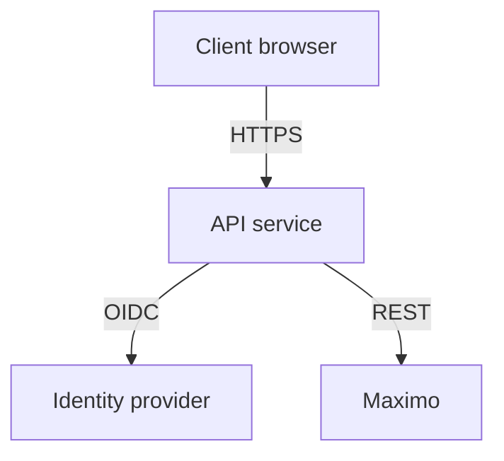

# Security

Security considerations for the pilot process.

- Review generated artifacts for sensitive information before export and attachment.
- Data flows only through approved environments (`dev`, `staging`, `prod`).
- Apply least-privilege permissions when accessing pilot resources.
- Report incidents immediately in `#pilot-support`.

## Threat model

### Abuse cases

- Replay of stolen bearer tokens
- Automated request flooding to exhaust rate limits
- CSRF attempts from malicious origins
- Export of sensitive information from generated artifacts

## Runbook

### CORS origins

The API only responds to requests from approved origins:

- `http://localhost:3000` for local development
- `https://loto.example.com` for production

### Authentication modes

- API key via the `MAXIMO_APIKEY` environment variable for server-to-server communication
- OAuth2 bearer tokens for user-facing flows

### OIDC token handling

OIDC bearer tokens presented in the `Authorization` header are validated for
issuer, audience, expiration, and required roles before processing. Tokens are
short-lived and are never persisted server side.

### CSRF protections

The API is stateless and does not issue cookies. Combined with strict CORS
rules, cross-site requests lack valid bearer tokens and are rejected.

### Rate-limit defaults

Requests are throttled with a token bucket. By default each process allows
**100000 requests every 60 seconds** globally and for monitored routes. Override
the behavior with the `RATE_LIMIT_CAPACITY` and `RATE_LIMIT_INTERVAL`
environment variables when necessary.

### Key rotation

Rotate API keys and credentials at least every **90 days**. Revoke and regenerate keys immediately if compromise is suspected.

### Log retention

Audit and access logs are retained for **30 days** in centralized storage and then purged.
